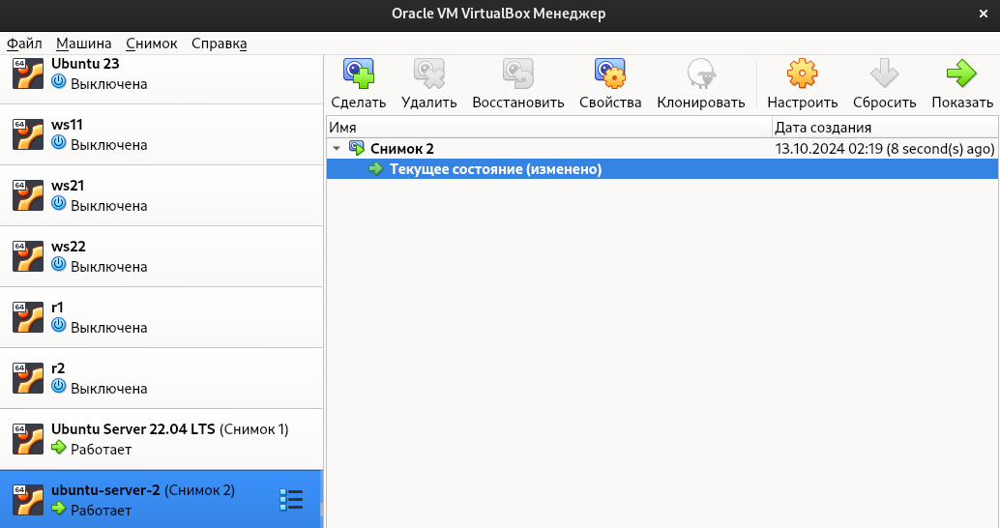

# Basic CI/CD

### Part 1. Настройка **gitlab-runner**

##### Поднимим виртуальную машину *Ubuntu Server 22.04 LTS*.

##### Скачаем и установим на виртуальную машину **gitlab-runner**.

##### Запустим **gitlab-runner** и зарегистрируем его для использования в текущем проекте (*DO6_CICD*).

### Part 2. Сборка

#### Напишим этап для **CI** по сборке приложений из проекта *C2_SimpleBashUtils*.
#### Для этого скопируем в папку `src` папки `cat` и `grep` из проекта `C2_SimpleBashUtils`:

##### В файле _.gitlab-ci.yml_ добавим этап запуска сборки через мейк файл из проекта _C2_.

##### Файлы, полученные после сборки (артефакты), сохраним в произвольную директорию со сроком хранения 30 дней.

##### Проверим сборку проекта

### Part 3. Тест кодстайла

#### Напишим этап для **CI**, который запускает скрипт кодстайла (*clang-format*).

##### Если кодстайл не прошел, то «зафейлим» пайплайн с помощью флага --Werror.

##### В пайплайне отобразим вывод утилиты *clang-format* с зафейлинным пайплайном.

#### Отобразим вывод утилиты *clang-format* с пройденным пайплайном.

### Part 4. Интеграционные тесты

#### Напишим этап для **CI**, который запускает наши интеграционные тесты из того же проекта.

##### Если тесты не прошли, то «зафейлим» пайплайн.

##### В пайплайне отобразим вывод, что интеграционные тесты успешно прошли / провалились.

### Part 5. Этап деплоя

#### Напишим этап для **CD**, который «разворачивает» проект на другой виртуальной машине.

##### Поднимим вторую виртуальную машину.

##### Соединим между собой виртуальные машины, для этого внесем изменения в сетевые настройки

##### Переключимся на первой виртиальной машине где у нас установлен `gitlab-runner` на пользователя `gitlab-runner`, и выполним генерацию пары ключей SSH с использованием алгоритма RSA командой `ssh-keygen -t rsa -b 2048` для настройки доступа к второму серверу с безпарольным доступом по SSH: 

##### Командой `ssh-copy-id server@10.10.0.1` скопируем публичный SSH-ключ на удалённый сервер, чтобы настроить безпарольный доступ по SSH:

##### На второй машине командой `sudo chmod -R 777 /usr/local/bin` предоставим доступ к файлам и папкам для чтения, изменения и исполнения файлов.

##### Проверим соединения между машинами без ввода пароля командой `ssh server@10.10.0.1`:

##### Запусти этот этап вручную при условии, что все предыдущие этапы прошли успешно.

##### Напишим bash-скрипт, который при помощи **ssh** и **scp** копирует файлы, полученные после сборки (артефакты), в директорию */usr/local/bin* второй виртуальной машины.

- Объясним по скрипту, как происходит перенос.
  разберем команду `ssh-keyscan -H 10.10.0.1 >> ~/.ssh/known_hosts`:

`ssh-keyscan`: утилита, которая собирает открытые SSH-ключи с указанного сервера.
`-H`: опция, которая выводит хосты в зашифрованном виде (защищает от DNS spoofing).
`10.10.0.1`: IP-адрес удалённого сервера, с которого нужно получить SSH-ключ.
`>> ~/.ssh/known_hosts`: команда добавляет (двойная стрелка >>) полученные SSH-ключи в файл `~/.ssh/known_hosts`. Этот файл используется для хранения известных ключей удалённых серверов, чтобы избежать запроса на подтверждение доверия при первом подключении по SSH.

разберем команду `scp artifacts/s21_cat artifacts/s21_grep server@10.10.0.1:/usr/local/bin`:

`scp`: утилита для безопасной копировки файлов между локальной и удалённой машинами через SSH.
`artifacts/s21_cat и artifacts/s21_grep`: локальные файлы, которые нужно скопировать (в данном случае это бинарные файлы, собранные в процессе сборки проекта).
`server@10.10.0.1:/usr/local/bin`: путь на удалённой машине, куда файлы будут скопированы.

разберем команду `ssh server@10.10.0.1 "chmod +x /usr/local/bin/s21_cat /usr/local/bin/s21_grep"`:

`ssh server@10.10.0.1`: команда для выполнения SSH-подключения к серверу с IP 10.10.0.1 от имени пользователя server.
`"chmod +x /usr/local/bin/s21_cat /usr/local/bin/s21_grep"`: команда, которая будет выполнена на удалённой машине. Она изменяет права доступа к файлам s21_cat и s21_grep, делая их исполняемыми (добавляет флаг +x).

##### В файле _gitlab-ci.yml_ добавим этап запуска написанного скрипта.

##### Проверим что в gitlabe все собирается:

##### Проверим что в результате мы получили готовые к работе приложения из проекта *C2_SimpleBashUtils* (s21_cat и s21_grep) на второй виртуальной машине.

##### Сохраним дампы образов виртуальных машин.

### Part 6. Дополнительно. Уведомления

##### Создадим бота в нашем telegram:

##### Настроем уведомления об успешном/неуспешном выполнении пайплайна через бота в *Telegram*.

##### Для этого сначала напишем скрипт:

##### Затем в файле _gitlab-ci.yml_ пропишем чтобы наш скрипт запускался после сборки

##### Проверяем что в нашем telegram выводятся уведомления:
